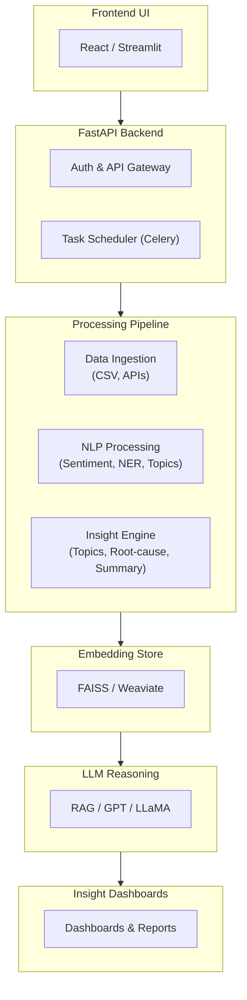

1. Goal:

Build an AI-powered conversatinal insights engine that:
* Ingests raw chat/meeting trasncripts 
* Extract sentiments, emotions, entities, action items and topics 
* Generate summarizes and root-cause analysis 
* Enable users to ask natural questions and get evidence-backed, explainable answers:
    - "Why are customers unhappy this week?"

2. System Overview:

Top level architecture:

